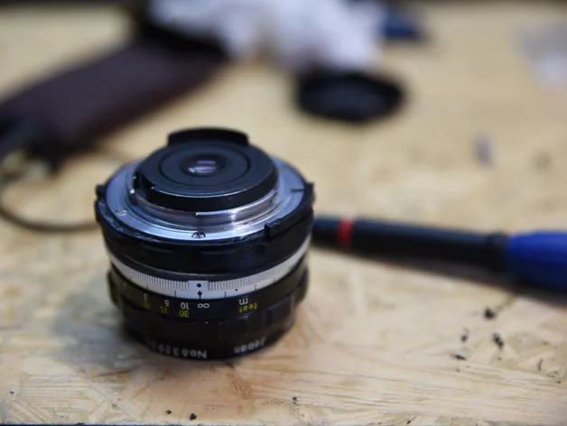

# 3D printed AI conversion kit for NIKKOR-H Auto 28mm f/3.5 (and probably others)

Just modify the parameters and print in as good quality as you can.

I haven't tried it in any other lens, but it works on the 28mm

The .stl file is exported a bit bigger (see comment at line 1 of 28mm_f3.5.scad) as my printer tends to print a little fatter parts.

## Rabbit ears

I recently got a Nikomat off ebay for cheap so I wanted to be able to use my Non-AI lenses on it. Thus I redesigned the ring to have rabbit ears (meter coupling prong).

I also designed the rabbit ears themselves if you don't mind sticking them on any AF-D lenses you might have and a version with a friction mounted ring so that you won't need to damage your lenses.

Here is my 50mm 1.8 with the rabbit ears mounted

